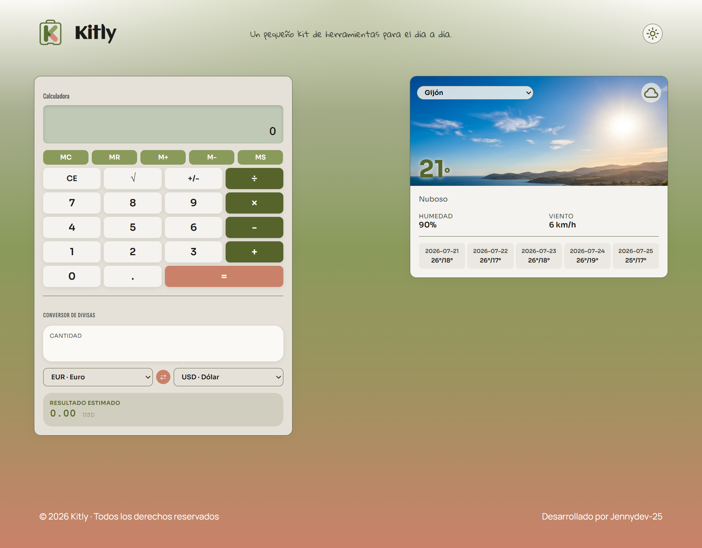
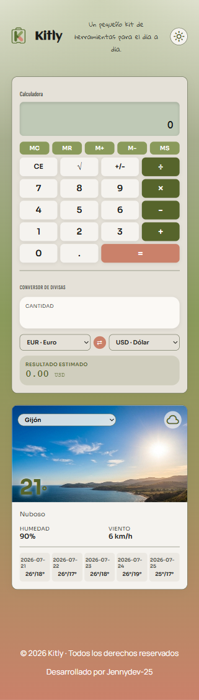
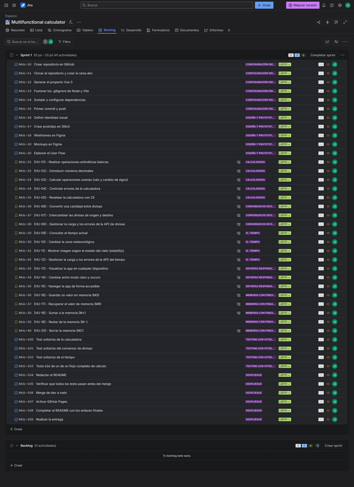
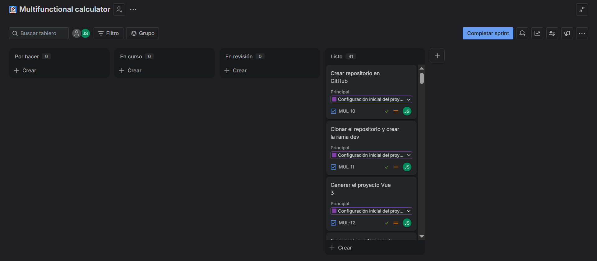
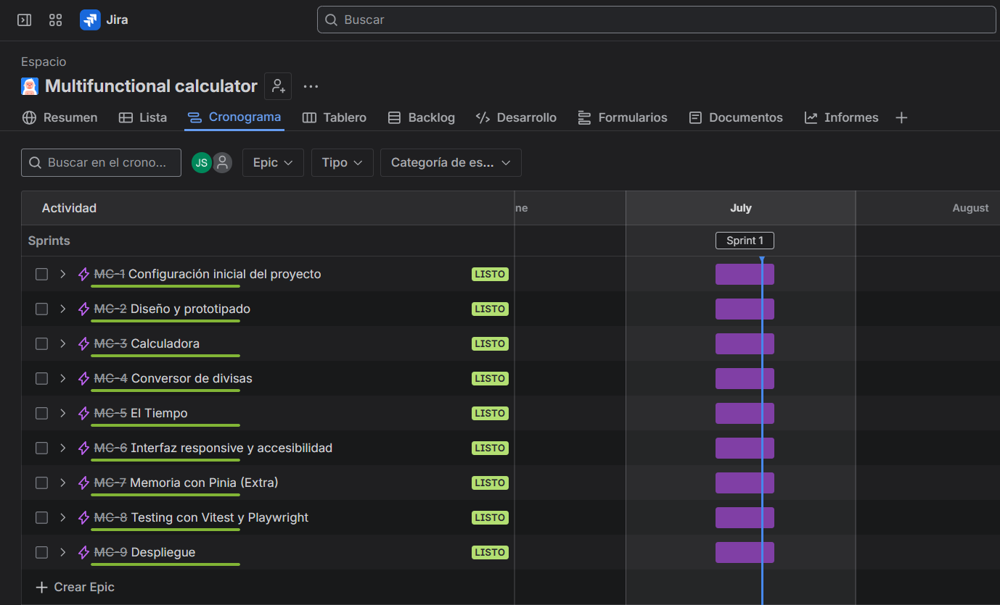
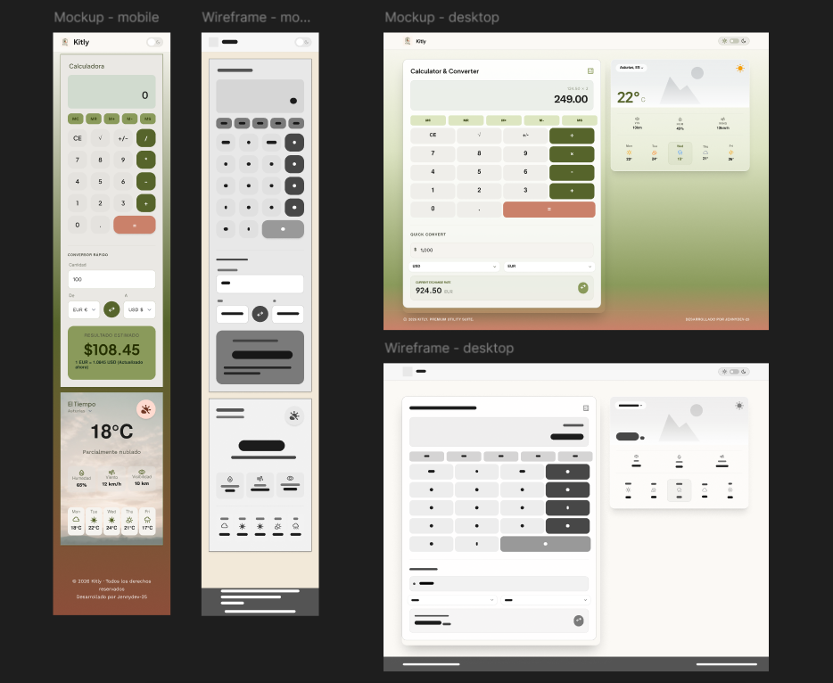
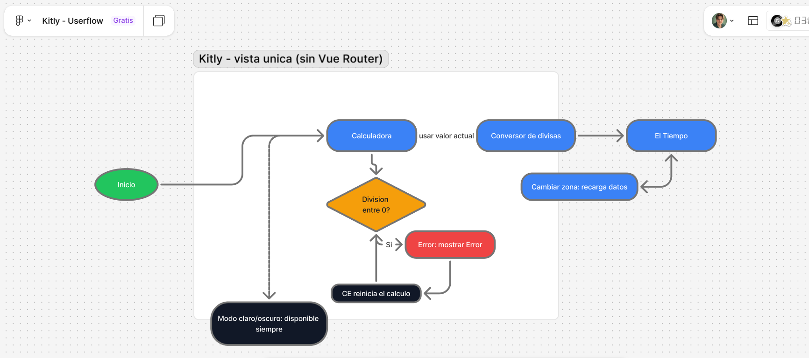
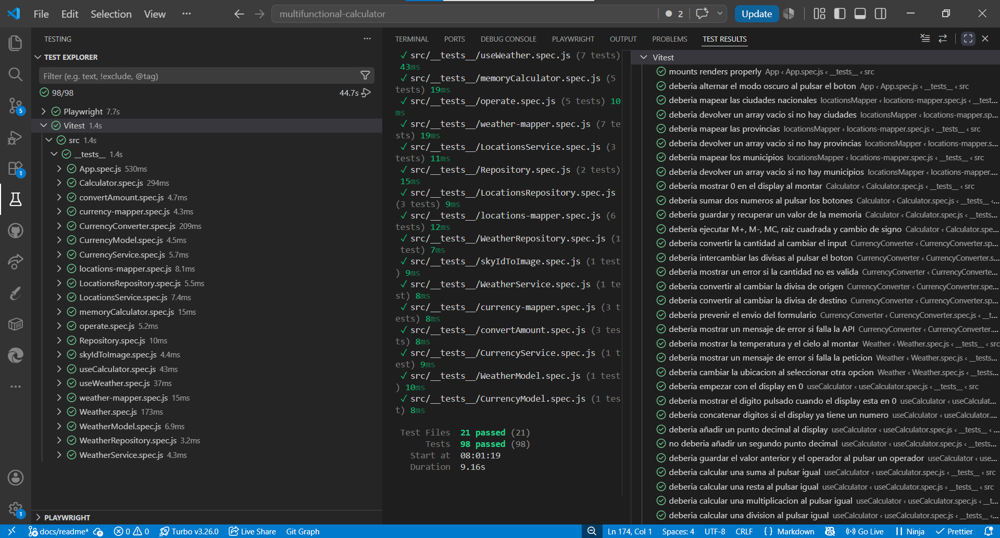
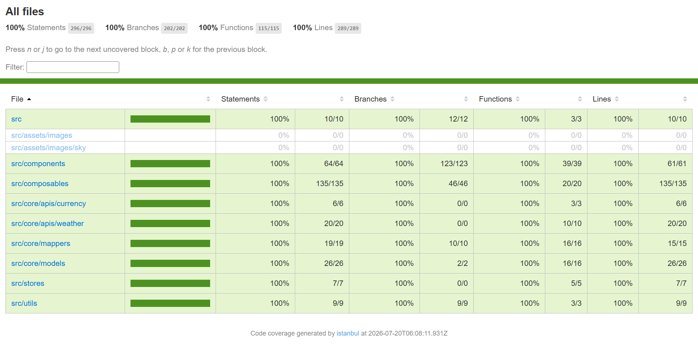
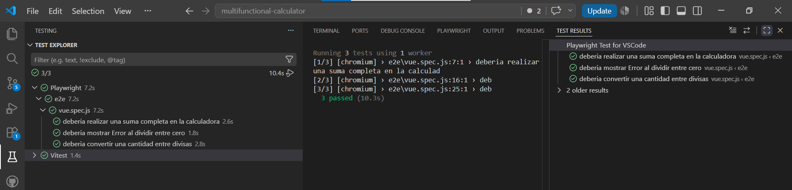

# 🧮 Kitly — Calculadora, Divisas y El Tiempo

> _Un pequeño kit de herramientas para el día a día._

---

## 📑 Índice

- [Despliegue](#-despliegue)
- [Vista de la aplicación](#-vista-de-la-aplicación)
- [Descripción](#-descripción)
- [Análisis](#-análisis)
- [Instalación](#-instalación)
- [Planificación](#-planificación)
- [Identidad visual](#-identidad-visual)
- [Prototipo y diseño](#-prototipo-y-diseño)
- [Userflow](#-userflow)
- [Accesibilidad](#-accesibilidad)
- [Historias de usuario y criterios de aceptación](#-historias-de-usuario-y-criterios-de-aceptación)
- [Tests](#-tests)
- [Estructura del repositorio](#-estructura-del-repositorio)
- [Tecnologías](#-tecnologías)
- [Recursos](#-recursos)
- [Autora](#-autora)

---

## 🌐 Despliegue

Despliegue automatizado mediante **GitHub Actions**: cada push a `main` ejecuta el build de producción con Vite, inyecta las variables de entorno (API keys y URLs base) como Secrets del repositorio, y publica el resultado en GitHub Pages.

> **App desplegada:** [Kitly](https://jennydev-25.github.io/multifunctional-calculator/)

---

## 📱 Vista de la aplicación

|                                  Escritorio                                  |                                 Móvil                                  |
| :--------------------------------------------------------------------------: | :--------------------------------------------------------------------: |
|  |  |

---

## 📖 Descripción

Objetivo: crear una calculadora multifuncional con el framework Vue.

**Requisitos mínimos de la calculadora:**

- La calculadora deberá poder realizar las operaciones básicas: suma, resta, multiplicación, división
- Teclas obligatorias: numéricas del 0 al 9, suma, resta, multiplicar, división, signo "igual", signo "." para la coma, CE (para resetear)
- Control de errores

**Requisitos mínimos del conversor de divisas:**

- Deberá estar integrado en la calculadora
- Divisas a utilizar: Euro (€), Dólar ($), Yen (¥)
- Se deberá utilizar la API de [CurrencyFreaks](https://currencyfreaks.com/)

**Requisitos mínimos de El Tiempo:**

- Se deberá utilizar la API de [el-tiempo.net](https://www.el-tiempo.net/api)
- Mostrar una imagen en función del "stateSky"
- Se puede elegir entre la información nacional o de una provincia (Asturias)

**Requisitos de desarrollo:** mobile-first, Axios para las llamadas a API, tests unitarios y tests E2E.

**Extras de calculadora:** tecla M+ para poner en memoria el número actual (con Pinia), tecla MR para recuperar el dato almacenado, tecla MC para borrar los datos guardados en memoria.

Todos los elementos están presentes en una sola vista, sin Vue Router.

---

## 🔍 Análisis

Antes de escribir ninguna línea de código, analicé el enunciado y planifiqué el proyecto en Jira. Tras revisar el enunciado con calma, decidí que el conversor viviera anidado dentro de la propia tarjeta de la calculadora, como una subsección visual separada por una línea divisoria, en vez de como una tarjeta independiente en la misma vista — así cumplía la letra del requisito sin duplicar lógica ni romper la reutilización del componente `CurrencyConverter.vue`.

A nivel de arquitectura, seguí el patrón **Repository + Service + Mapper + Model** para las llamadas a las APIs externas (divisas y tiempo), separando la responsabilidad de "hacer la petición" (`Repository`), "orquestar la lógica" (`Service`), "traducir la respuesta cruda" (`mapper`) y "exponer un objeto limpio" (`Model`). La lógica de cada módulo vive en su propio **composable** de la Composition API, y los componentes Vue se limitan a conectar esa lógica con la interfaz, sin mezclar responsabilidades.

Trabajé con **GitFlow** y **TDD** (ciclo Red-Green-Refactor), con commits atómicos siguiendo **Conventional Commits**, y una rama por funcionalidad.

---

## 🚀 Instalación

```bash
# 1. Clonar el repositorio
git clone https://github.com/Jennydev-25/multifunctional-calculator.git

# 2. Entrar en la carpeta
cd multifunctional-calculator

# 3. Instalar dependencias
npm install

# 4. Configurar variables de entorno
# Crea un archivo .env en la raíz:
# VITE_CURRENCYFREAKS_API_KEY=tu_api_key
# VITE_CURRENCYFREAKS_BASE_URL=https://api.currencyfreaks.com/v2.0
# VITE_WEATHER_BASE_URL=https://api.el-tiempo.net/json/v3

# 5. Iniciar el servidor de desarrollo
npm run dev

# 6. Ejecutar tests unitarios
npm run test:unit

# 7. Ejecutar tests con cobertura
npm run test:coverage

# 8. Ejecutar tests E2E
npx playwright install chromium
npm run test:e2e
```

---

## 📋 Planificación

Proyecto gestionado con **Jira**, organizado en 9 épicas:

- Configuración inicial del proyecto
- Diseño y prototipado
- Calculadora
- Conversor de divisas
- El Tiempo
- Interfaz responsive y accesibilidad
- Memoria con Pinia (extra)
- Testing con Vitest y Playwright
- Despliegue

📸 Capturas de Jira:

|                          Backlog                           |                         Tablero                          |                           Cronograma                            |
| :--------------------------------------------------------: | :------------------------------------------------------: | :-------------------------------------------------------------: |
|  |  |  |

---

## 🎨 Identidad visual

**Nombre:** **Kitly** — viene de _kit_ (caja de herramientas), con la terminación "-ly" típica de nombre de producto. Representa una app pensada para crecer más allá de sus tres funciones actuales.

**Logotipo:** una "K" formada por tres bloques de color (verde oliva, verde salvia y terracota) dentro del contorno de un maletín.

**Concepto:** herramienta multiuso que crece — el nombre y el símbolo no dependen de las tres funciones actuales. Estética cálida y amable: fondo arena, tarjetas en beige claro, tipografía redondeada.

**Paleta de color:**

| Nombre                                     |    HEX    |
| :----------------------------------------- | :-------: |
| Fondo principal                            | `#fbf9f5` |
| Superficie — tarjetas                      | `#f5f3ef` |
| Verde oliva — color principal / operadores | `#56642b` |
| Verde salvia — display de la calculadora   | `#d1dbcf` |
| Terracota — botón "="                      | `#ca816a` |
| Texto principal                            | `#1b1c1a` |
| Texto apagado                              | `#46483c` |
| Fondo modo oscuro                          | `#14150f` |

**Tipografías:**

- **Aclonica** — logotipo
- **Gloria Hallelujah** — eslogan (tagline)
- **Sofia Sans Extra Condensed** — encabezados
- **Sora** — textos de cuerpo
- **Manrope** — footer

---

## 🎨 Prototipo y diseño

El diseño se realizó con **Google Stitch**, y los wireframes de baja fidelidad para validar la distribución de los tres módulos (calculadora, conversor, tiempo), y después mockups de alta fidelidad con la paleta y tipografía definitivas, en versiones mobile y desktop se realizaron con Figma.

🔗 [Ver prototipo en Stitch](https://stitch.withgoogle.com/projects/7427523778998256084)

🔗 [Ver mockups y wireframes en Figma](https://www.figma.com/design/K7GGaENCk5f7cQ6CnnytvB/Kitly?node-id=0-1&t=D5hnjAMSPeJjo7Uh-1)

|                         Mockups y wireframes                          |
| :-------------------------------------------------------------------: |
|  |

---

## 🗺️ Userflow

Diseñado en Figma Board antes del desarrollo para mapear las rutas principal y alternativas de la aplicación, y validar que los tres módulos encajaban de forma natural en una sola vista, sin necesidad de Vue Router.

🔗 [Ver userflow en Figma](https://www.figma.com/board/7Z2nkzO16ojbN9pPYA7EvZ/Kitly---Userflow?t=oO8MOqjWKkMbeoxH-0)

|                           Userflow completo                            |
| :--------------------------------------------------------------------: |
|  |

| Ruta        | Descripción                                                                                |
| :---------- | :----------------------------------------------------------------------------------------- |
| Principal   | Introducir número → operar → ver resultado → convertir a otra divisa → consultar el tiempo |
| Alternativa | División por cero → mostrar error → pulsar CE → seguir operando                            |
| Alternativa | Cambiar zona meteorológica (nacional / provincia / municipio) → recargar datos del tiempo  |
| Alternativa | Alternar modo claro/oscuro en cualquier punto del flujo                                    |

---

## ♿ Accesibilidad

- HTML semántico: `header`, `main`, `section`, `footer`
- `aria-label` en todos los botones con símbolos (√, +/-, ⇄, iconos de Material Symbols)
- `aria-live="polite"` en el display de la calculadora y en el resultado del conversor
- Etiquetas `<label>` asociadas a todos los campos de formulario, incluidas las ocultas visualmente con `.sr-only` para los `<select>` de divisa y ubicación
- Jerarquía de encabezados correcta (`<h2>` por módulo, `<h3>` para el conversor anidado dentro de la calculadora)
- Navegación por teclado en todos los elementos interactivos
- Contraste de color cuidado en modo claro y modo oscuro

---

## 👤 Historias de usuario y criterios de aceptación

---

### HU-01 — Realizar operaciones aritméticas básicas

- **Como** usuario
- **Quiero** sumar, restar, multiplicar y dividir dos números
- **Para** obtener el resultado de un cálculo

<details>
<summary>Criterios de aceptación</summary>

- **Escenario 1: Suma correcta**
  - **Dado** que he introducido el número 5
  - **Cuando** pulso "+", introduzco 3 y pulso "="
  - **Entonces** el display muestra 8
- **Escenario 2: Resta correcta**
  - **Dado** que he introducido el número 9
  - **Cuando** pulso "−", introduzco 4 y pulso "="
  - **Entonces** el display muestra 5
- **Escenario 3: Multiplicación correcta**
  - **Dado** que he introducido el número 6
  - **Cuando** pulso "×", introduzco 7 y pulso "="
  - **Entonces** el display muestra 42
- **Escenario 4: División correcta**
  - **Dado** que he introducido el número 10
  - **Cuando** pulso "÷", introduzco 2 y pulso "="
  - **Entonces** el display muestra 5
- **Escenario 5: Operaciones encadenadas**
  - **Dado** que he obtenido un resultado previo
  - **Cuando** pulso un nuevo operador e introduzco otro número
  - **Entonces** la operación se aplica sobre el resultado anterior

</details>

---

### HU-02 — Introducir números decimales

- **Como** usuario
- **Quiero** usar la tecla "." para introducir decimales
- **Para** operar con números no enteros

<details>
<summary>Criterios de aceptación</summary>

- **Escenario 1: Introducir un decimal**
  - **Dado** que he introducido el número 3
  - **Cuando** pulso "." e introduzco 5
  - **Entonces** el display muestra 3.5
- **Escenario 2: Evitar doble punto decimal**
  - **Dado** que ya he introducido un número con punto decimal
  - **Cuando** pulso "." de nuevo
  - **Entonces** el display no añade un segundo punto

</details>

---

### HU-03 — Calcular operaciones unarias (raíz y cambio de signo)

- **Como** usuario
- **Quiero** calcular la raíz cuadrada y cambiar el signo del número actual
- **Para** disponer de funciones de una calculadora completa

<details>
<summary>Criterios de aceptación</summary>

- **Escenario 1: Raíz cuadrada**
  - **Dado** que he introducido el número 9
  - **Cuando** pulso "√"
  - **Entonces** el display muestra 3
- **Escenario 2: Cambio de signo positivo a negativo**
  - **Dado** que he introducido el número 5
  - **Cuando** pulso "+/−"
  - **Entonces** el display muestra −5
- **Escenario 3: Cambio de signo negativo a positivo**
  - **Dado** que he introducido el número −5
  - **Cuando** pulso "+/−"
  - **Entonces** el display muestra 5
- **Escenario 4: Raíz de número negativo**
  - **Dado** que he introducido un número negativo
  - **Cuando** pulso "√"
  - **Entonces** el display muestra un mensaje de error controlado

</details>

---

### HU-04 — Controlar errores de la calculadora

- **Como** usuario
- **Quiero** que la calculadora gestione entradas y operaciones inválidas
- **Para** que la aplicación no se bloquee ni muestre resultados incorrectos

<details>
<summary>Criterios de aceptación</summary>

- **Escenario 1: División por cero**
  - **Dado** que he introducido el número 8
  - **Cuando** pulso "÷", introduzco 0 y pulso "="
  - **Entonces** el display muestra "Error" y bloquea el cálculo
- **Escenario 2: Recuperación tras un error**
  - **Dado** que el display muestra un mensaje de error
  - **Cuando** pulso cualquier tecla numérica
  - **Entonces** se inicia una operación nueva desde cero
- **Escenario 3: Operador sin segundo operando**
  - **Dado** que he introducido "5" y pulsado "+"
  - **Cuando** pulso "=" sin introducir un segundo número
  - **Entonces** la calculadora no calcula y no rompe la app
- **Escenario 4: Pulsar "=" sin ninguna operación en curso**
  - **Dado** que solo tengo un número en el display, sin operador
  - **Cuando** pulso "="
  - **Entonces** el display devuelve el número actual sin generar error
- **Escenario 5: Operadores consecutivos**
  - **Dado** que he pulsado "5" seguido de "+"
  - **Cuando** pulso otro operador ("−") antes de introducir el segundo número
  - **Entonces** se sustituye el operador anterior por el nuevo
- **Escenario 6: Límite de longitud del display**
  - **Dado** que estoy introduciendo dígitos
  - **Cuando** el número alcanza el límite de caracteres del display
  - **Entonces** no se aceptan más dígitos adicionales
- **Escenario 7: Resultado Infinity**
  - **Dado** que una operación produce un resultado infinito
  - **Cuando** se calcula el resultado
  - **Entonces** se detecta con `Number.isFinite` y se muestra un error controlado
- **Escenario 8: Ceros iniciales**
  - **Dado** que el display está en 0
  - **Cuando** introduzco varios ceros seguidos
  - **Entonces** no se acumulan ceros innecesarios a la izquierda

</details>

---

### HU-05 — Resetear la calculadora con CE

- **Como** usuario
- **Quiero** borrar el cálculo actual con la tecla "CE"
- **Para** empezar una nueva operación desde cero

<details>
<summary>Criterios de aceptación</summary>

- **Escenario 1: Reset del display**
  - **Dado** que tengo un número o resultado en el display
  - **Cuando** pulso "CE"
  - **Entonces** el display vuelve a mostrar 0 y se limpia el estado interno

</details>

---

### HU-06 — Convertir una cantidad entre divisas

- **Como** usuario
- **Quiero** introducir una cantidad y convertirla entre Euro, Dólar y Yen
- **Para** conocer su valor en otra moneda

<details>
<summary>Criterios de aceptación</summary>

- **Escenario 1: Conversión correcta**
  - **Dado** que he introducido una cantidad y seleccionado moneda origen y destino
  - **Cuando** se realiza la conversión
  - **Entonces** el resultado muestra la cantidad convertida según el tipo de cambio de la API
- **Escenario 2: Tipo de cambio visible**
  - **Dado** que se ha realizado una conversión
  - **Cuando** veo el resultado
  - **Entonces** se muestra el tipo de cambio aplicado

</details>

---

### HU-07 — Intercambiar las divisas de origen y destino

- **Como** usuario
- **Quiero** intercambiar la moneda de origen y la de destino con un botón
- **Para** invertir la conversión rápidamente

<details>
<summary>Criterios de aceptación</summary>

- **Escenario 1: Intercambio de divisas**
  - **Dado** que tengo EUR como origen y USD como destino
  - **Cuando** pulso el botón de intercambio (⇄)
  - **Entonces** el origen pasa a ser USD y el destino EUR, y el resultado se recalcula

</details>

---

### HU-08 — Gestionar la carga y los errores de la API de divisas

- **Como** usuario
- **Quiero** ver un indicador de carga y un mensaje si la API falla
- **Para** saber en todo momento el estado de la conversión

<details>
<summary>Criterios de aceptación</summary>

- **Escenario 1: Estado de carga**
  - **Dado** que se está solicitando el tipo de cambio a la API
  - **Cuando** la respuesta aún no ha llegado
  - **Entonces** se muestra un indicador de carga
- **Escenario 2: Error de la API**
  - **Dado** que la API de divisas no responde o devuelve un error
  - **Cuando** intento realizar una conversión
  - **Entonces** se muestra un mensaje de error amigable y la calculadora sigue funcionando
- **Escenario 3: Valor de importe vacío o inválido**
  - **Dado** que el campo de cantidad está vacío o contiene texto no numérico
  - **Cuando** intento convertir
  - **Entonces** no se realiza la conversión y se muestra un aviso de validación

</details>

---

### HU-09 — Consultar el tiempo actual

- **Como** usuario
- **Quiero** ver la temperatura y el estado del tiempo actual
- **Para** conocer las condiciones meteorológicas

<details>
<summary>Criterios de aceptación</summary>

- **Escenario 1: Mostrar datos del tiempo**
  - **Dado** que accedo al módulo del tiempo
  - **Cuando** se cargan los datos de la API
  - **Entonces** se muestra la temperatura, el estado y los datos secundarios (humedad, viento)

</details>

---

### HU-10 — Cambiar la zona meteorológica

- **Como** usuario
- **Quiero** elegir entre información nacional o de una provincia o municipio
- **Para** consultar el tiempo de la zona que me interesa

<details>
<summary>Criterios de aceptación</summary>

- **Escenario 1: Zona por defecto**
  - **Dado** que accedo al módulo del tiempo por primera vez
  - **Cuando** se carga
  - **Entonces** aparece Gijón seleccionado por defecto
- **Escenario 2: Cambio de zona**
  - **Dado** que estoy viendo el tiempo de una zona
  - **Cuando** selecciono otra zona en el desplegable
  - **Entonces** los datos se actualizan a la zona seleccionada

</details>

---

### HU-11 — Mostrar imagen según el estado del cielo (stateSky)

- **Como** usuario
- **Quiero** ver una imagen coherente con el estado del cielo
- **Para** identificar el tiempo de un vistazo

<details>
<summary>Criterios de aceptación</summary>

- **Escenario 1: Imagen coherente con stateSky**
  - **Dado** que la API devuelve un valor de stateSky
  - **Cuando** se muestran los datos del tiempo
  - **Entonces** se muestra una imagen coherente con ese estado (soleado, nuboso, lluvia, cubierto)
- **Escenario 2: stateSky desconocido**
  - **Dado** que la API devuelve un valor de stateSky no contemplado en el mapeo
  - **Cuando** se muestran los datos del tiempo
  - **Entonces** se muestra una imagen genérica por defecto, nunca un hueco vacío

</details>

---

### HU-12 — Gestionar la carga y los errores de la API del tiempo

- **Como** usuario
- **Quiero** ver un indicador de carga y un mensaje si la API del tiempo falla
- **Para** saber el estado de la consulta

<details>
<summary>Criterios de aceptación</summary>

- **Escenario 1: Estado de carga**
  - **Dado** que se están solicitando los datos del tiempo
  - **Cuando** la respuesta aún no ha llegado
  - **Entonces** se muestra un indicador de carga
- **Escenario 2: API caída**
  - **Dado** que la API del tiempo no responde o devuelve un error
  - **Cuando** intento consultar el tiempo
  - **Entonces** se muestra un mensaje de error amigable y la app no se bloquea
- **Escenario 3: Datos incompletos**
  - **Dado** que la API devuelve una respuesta con campos faltantes
  - **Cuando** se procesan los datos
  - **Entonces** se muestran valores por defecto en los campos afectados, sin romper la interfaz

</details>

---

### HU-13 — Visualizar la app en cualquier dispositivo

- **Como** usuario
- **Quiero** usar la aplicación cómodamente en móvil, tablet y escritorio
- **Para** acceder a ella desde cualquier dispositivo

<details>
<summary>Criterios de aceptación</summary>

- **Escenario 1: Vista móvil**
  - **Dado** que accedo desde un móvil
  - **Cuando** se carga la app
  - **Entonces** los módulos se muestran apilados en una sola columna
- **Escenario 2: Vista escritorio**
  - **Dado** que accedo desde un escritorio
  - **Cuando** se carga la app
  - **Entonces** la calculadora y el tiempo se muestran en dos columnas

</details>

---

### HU-14 — Cambiar entre modo claro y oscuro

- **Como** usuario
- **Quiero** alternar entre modo claro y oscuro con un interruptor
- **Para** adaptar la interfaz a mi preferencia o entorno

<details>
<summary>Criterios de aceptación</summary>

- **Escenario 1: Activar modo oscuro**
  - **Dado** que estoy en modo claro
  - **Cuando** pulso el interruptor de tema
  - **Entonces** la interfaz cambia a modo oscuro y el icono refleja el estado activo
- **Escenario 2: Volver a modo claro**
  - **Dado** que estoy en modo oscuro
  - **Cuando** pulso el interruptor de tema
  - **Entonces** la interfaz vuelve a modo claro
- **Escenario 3: Persistencia del tema**
  - **Dado** que he elegido un tema
  - **Cuando** recargo la página
  - **Entonces** se mantiene el tema elegido

</details>

---

### HU-15 — Navegar la app de forma accesible

- **Como** usuario que usa teclado o lector de pantalla
- **Quiero** que la interfaz sea accesible
- **Para** poder utilizar la aplicación sin barreras

<details>
<summary>Criterios de aceptación</summary>

- **Escenario 1: Etiquetas accesibles**
  - **Dado** que navego con un lector de pantalla
  - **Cuando** llego a un botón con símbolo (√, ⇄, +/−)
  - **Entonces** el botón tiene un aria-label descriptivo
- **Escenario 2: Foco visible**
  - **Dado** que navego con teclado
  - **Cuando** recorro los elementos interactivos
  - **Entonces** el foco es visualmente claro en todo momento

</details>

---

### HU-16 — Guardar un valor en memoria (MS)

- **Como** usuario
- **Quiero** guardar el número actual en memoria con la tecla "MS"
- **Para** reutilizarlo más adelante en mis cálculos

<details>
<summary>Criterios de aceptación</summary>

- **Escenario 1: Guardar en memoria**
  - **Dado** que tengo un número en el display
  - **Cuando** pulso "MS"
  - **Entonces** el valor se guarda en memoria
- **Escenario 2: Sobrescribir un valor guardado**
  - **Dado** que ya tengo un valor guardado en memoria
  - **Cuando** pulso "MS" con un nuevo número en el display
  - **Entonces** el valor anterior se sobrescribe con el nuevo

</details>

---

### HU-17 — Recuperar el valor de memoria (MR)

- **Como** usuario
- **Quiero** recuperar el valor guardado en memoria con la tecla "MR"
- **Para** continuar un cálculo con ese valor

<details>
<summary>Criterios de aceptación</summary>

- **Escenario 1: Recuperar de memoria**
  - **Dado** que tengo un valor guardado en memoria
  - **Cuando** pulso "MR"
  - **Entonces** el display muestra el valor almacenado

</details>

---

### HU-18 — Sumar a la memoria (M+)

- **Como** usuario
- **Quiero** sumar el número actual al valor guardado en memoria con la tecla "M+"
- **Para** acumular resultados sin perder el valor guardado

<details>
<summary>Criterios de aceptación</summary>

- **Escenario 1: Sumar a memoria**
  - **Dado** que tengo un valor en memoria y un número en el display
  - **Cuando** pulso "M+"
  - **Entonces** el número del display se suma al valor de la memoria

</details>

---

### HU-19 — Restar de la memoria (M−)

- **Como** usuario
- **Quiero** restar el número actual del valor guardado en memoria con la tecla "M−"
- **Para** ajustar el valor acumulado en memoria

<details>
<summary>Criterios de aceptación</summary>

- **Escenario 1: Restar de memoria**
  - **Dado** que tengo un valor en memoria y un número en el display
  - **Cuando** pulso "M−"
  - **Entonces** el número del display se resta del valor de la memoria

</details>

---

### HU-20 — Borrar la memoria (MC)

- **Como** usuario
- **Quiero** borrar el valor guardado en memoria con la tecla "MC"
- **Para** empezar de nuevo sin datos residuales

<details>
<summary>Criterios de aceptación</summary>

- **Escenario 1: Borrar memoria**
  - **Dado** que tengo un valor guardado en memoria
  - **Cuando** pulso "MC"
  - **Entonces** la memoria se vacía

</details>

---

## 🧪 Tests

### Vitest — Tests unitarios y de componente

| Categoría              | Descripción                                                                                                               |
| :--------------------- | :------------------------------------------------------------------------------------------------------------------------ |
| Lógica pura (`utils/`) | `operate`, `convertAmount`, `skyIdToImage`                                                                                |
| Composables            | `useCalculator`, `useCurrencyConverter`, `useWeather`                                                                     |
| Store (Pinia)          | `memoryCalculator`                                                                                                        |
| Capa de API (`core/`)  | `Repository`, `CurrencyRepository/Service`, `WeatherRepository/Service`, `LocationsRepository/Service`, mappers y modelos |
| Componentes            | `Calculator.vue`, `CurrencyConverter.vue`, `Weather.vue`, `App.vue`                                                       |

**Total: 98 tests, 21 archivos, todos en verde.**

**Cobertura global (v8):**

- **100%** - `Statements`
- **100%** - `Branch`
- **100%** - `Funcs`
- **100%** - `Lines`

📸 Capturas de tests:

|                                Vitest                                |                                Cobertura                                |
| :------------------------------------------------------------------: | :---------------------------------------------------------------------: |
|  |  |

### Playwright — Tests E2E

| Archivo       | Escenarios | Pasan |
| :------------ | :--------: | :---: |
| `vue.spec.js` |     3      |  3/3  |

**Total: 3 tests E2E, todos en verde (Chromium).**

|                                  Playwright                                  |
| :--------------------------------------------------------------------------: |
|  |

---

## 🗂️ Estructura del repositorio

```text
multifunctional-calculator/
├── index.html
├── jsconfig.json
├── package.json
├── vite.config.js
├── vitest.config.js
├── playwright.config.js
├── .env.example
├── .github/
│   └── workflows/
│       └── deploy.yml
├── public/
│   ├── favicon.ico
│   └── favicons/
├── e2e/
│   └── vue.spec.js
└── src/
    ├── main.js
    ├── App.vue
    ├── components/
    │   ├── Calculator.vue
    │   ├── CurrencyConverter.vue
    │   └── Weather.vue
    ├── composables/
    │   ├── useCalculator.js
    │   ├── useCurrencyConverter.js
    │   └── useWeather.js
    ├── core/
    │   ├── repositories/
    │   │   ├── Repository.js
    │   │   ├── CurrencyRepository.js
    │   │   ├── WeatherRepository.js
    │   │   └── LocationsRepository.js
    │   ├── services/
    │   │   ├── CurrencyService.js
    │   │   ├── WeatherService.js
    │   │   └── LocationsService.js
    │   ├── mappers/
    │   │   ├── currency-mapper.js
    │   │   ├── weather-mapper.js
    │   │   └── locations-mapper.js
    │   └── models/
    │       ├── CurrencyModel.js
    │       └── WeatherModel.js
    ├── stores/
    │   └── memoryCalculator.js
    ├── utils/
    │   ├── operate.js
    │   ├── convertAmount.js
    │   └── skyIdToImage.js
    ├── assets/
    │   └── images/
    │       ├── logo.png
    │       ├── sky/
    │       │   ├── sunny.png
    │       │   ├── cloudy.png
    │       │   ├── overcast.png
    │       │   └── rain.png
    │       └── screenshots/
    │           ├── app/
    │           ├── jira/
    │           ├── prototype/
    │           ├── tests/
    │           └── userflow/
    ├── styles/
    │   ├── main.scss
    │   └── base/
    │       ├── _variables.scss
    │       ├── _typography.scss
    │       └── _base.scss
    └── __tests__/
        └── (21 archivos de tests con Vitest y Vue Test Utils)
```

---

## 🛠️ Tecnologías

- [Vue 3](https://vuejs.org/) — framework principal (Composition API, `<script setup>`)
- [Pinia](https://pinia.vuejs.org/) — gestión de estado (memoria de la calculadora)
- [Axios](https://axios-http.com/) — llamadas a las APIs
- [Sass](https://sass-lang.com/) — estilos
- [Vitest](https://vitest.dev/) — tests unitarios y de componente
- [Vue Test Utils](https://test-utils.vuejs.org/) — montaje y testing de componentes Vue
- [Playwright](https://playwright.dev/) — tests E2E
- [Vite](https://vite.dev/) — bundler
- [Git](https://git-scm.com/) & [GitHub](https://github.com/) — control de versiones con GitFlow
- [Jira](https://www.atlassian.com/software/jira) — planificación del proyecto
- [Google Stitch](https://stitch.withgoogle.com/) — diseño y prototipado
- [GitHub Pages](https://pages.github.com/) — despliegue

---

## 📚 Recursos

- [Documentación de Vue 3](https://vuejs.org/)
- [Documentación de Pinia](https://pinia.vuejs.org/)
- [Documentación de Vitest](https://vitest.dev/)
- [Documentación de Playwright](https://playwright.dev/)
- [CurrencyFreaks API](https://currencyfreaks.com/documentation)
- [El Tiempo API](https://www.el-tiempo.net/api)

---

## ✍️ Autora

**[Jenny Sánchez Requejo](https://github.com/Jennydev-25)**
